[Horde](../Home.md) > [Configuration](../Config.md) > Test Automation Hub

# Test Automation Hub (v2)

The Horde Test Automation Hub surfaces test phases results grouped by [Gauntlet](https://docs.unrealengine.com/en-US/gauntlet-automation-framework-overview-in-unreal-engine)
tests.  Horde efficiently generates searchable metadata for streams,
platforms, configurations, rendering apis, etc.  The test automation
hub is used at Epic by QA, release managers, and code owners to quickly
view and investigate the latest test results across platforms and
streams.  It provides historical data and views which drill into specific
test events which can include screenshots, logging, and callstacks.

In addition to enabling Horde [build automation](BuildAutomation.md), the
configuration required to surface test results is simply adding the 
`-WriteTestResultsForHorde` Gauntlet test command line argument.  Please
see the BuildGraph [example](#buildgraph-example) below for details.

## Test Automation Filters

The test automation UI is data driven and automatically populated from test
session metadata.  Test results can be filtered by streams, tests, tags, 
platforms, configurations, targets, and any key/value pair that has been
attached to the test result through its report.  Detailed selections may
also be linked for sharing or to be bookmarked.  

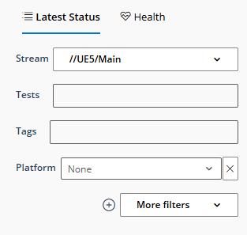

## Latest Status Tiles

Latest test results are presented as tiles which surface relative status based on the stream and filters selected.  

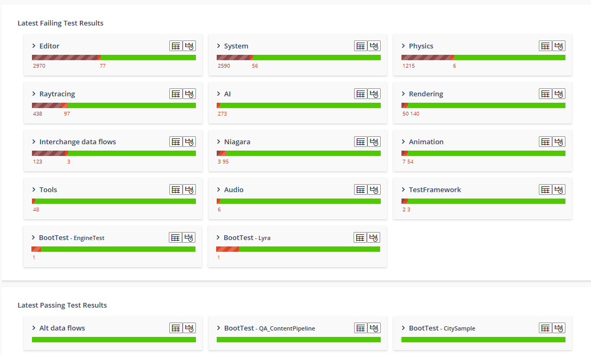

Status tiles can be expanded to view further details such as platforms and
changelists, which are linked to individual [test report](#test-report) to assist in issue
investigation.  

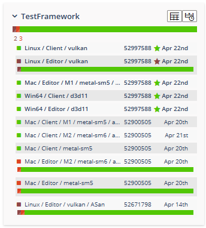

A test phase grid view and test history graph are also available which allow different ways to display result history.  

[Phase Grid](#phase-grid)
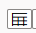

[Test History](#test-history)
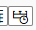

## Test Report

In the detailed test report, the test phases are listed in the order they
were executed and their related outcome.  The top right section of the
view allows applying different filters, either by phase name, phase tags
and outcomes. 

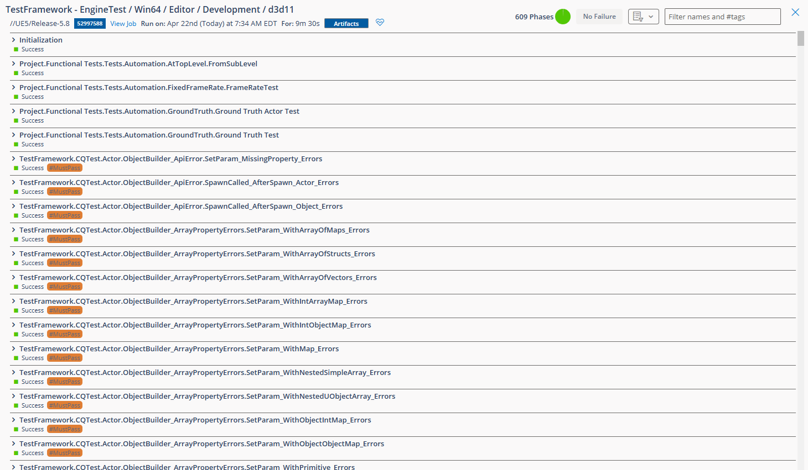

### Test Phase
Clicking on a phase will expand that phase details and gives access to
captured test events, including screenshot comparisons.  A timeseries
graph will also be visible to help identify the introduction of the
regression.  Clicking on individual circle will load that report and
display the associated events.

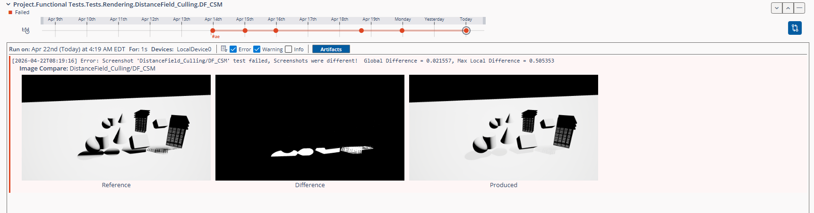

A comparison view can be toggled with the blue icon on the right to be
able to compare results from the same phase either through time, across
test environment or even streams.  Using the timeseries graph allows
comparing with sessions from other commits.

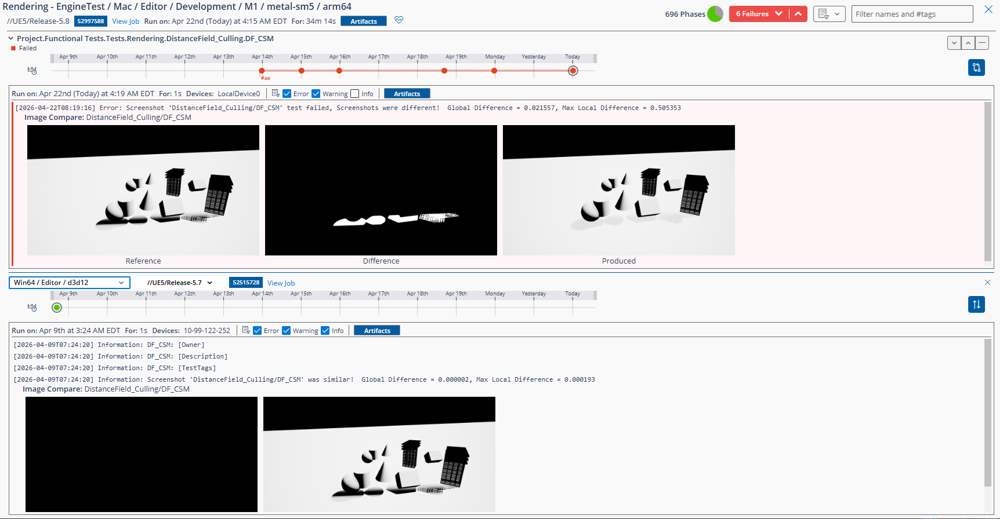

## Phase Grid

The purpose of this view is to display in one page all latest phase
results across test environments.  Some tests in Gauntlet uses phases
to represent units of test or individual functional tests executed in
the same session.

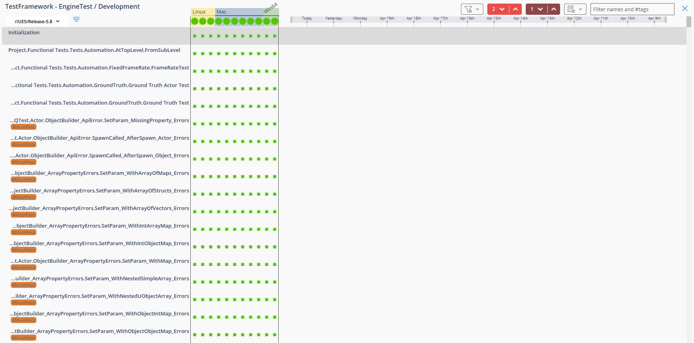

The top middle section of the view gives an overview of which test
environments are available, and what are their respective overall
ratios based on the right-side filters.  

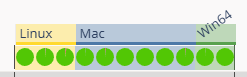

The test environments are based on test session metadata provided by
the test report and each represents a distinct set of metadata.  The
top names are the groups of partial match metadata key/value.  
Clicking on one adds it as a filter and breaks down the next groups.

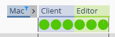

Clicking on a column will select that test environment.

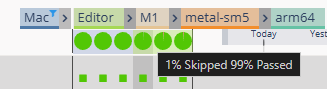

This will update the right-side panel in front of each phase.  
Which displays the phase outcome timeseries related to the selected
test environment.

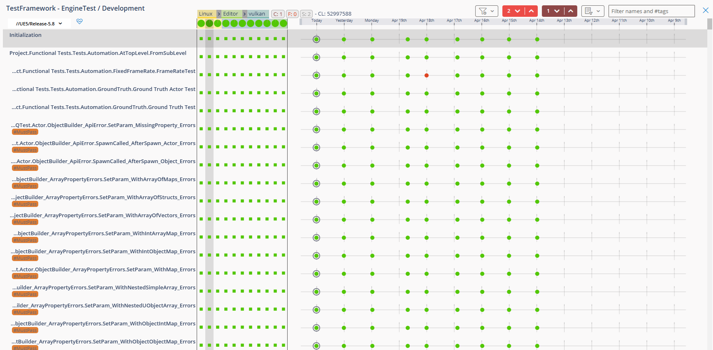

When a failure is displayed in the test environments columns, the
number inside represents the number of days that failure has been
reproduced.  The # value is the shorthand of the unique id of that
failure.  Which allows one to identify quickly the impact of a failure
across environments.

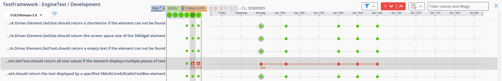

Clicking on any circle will open the related detailed [test phase report](#test-phase)

## Test History

The Test History graphs allow one to have an overall vision of the test
results.  Each circle represents a test run.  The concentric circle
sizes are proportional to the Fail/Pass rate, including catastrophic
failure rate.

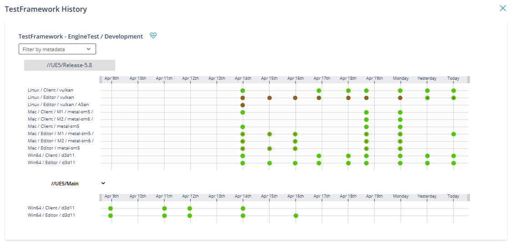

Clicking on any circle will open the related detailed [test report](#test-report)

## BuildGraph Example

The following [**BuildGraph**](https://docs.unrealengine.com/en-US/buildgraph-for-unreal-engine/) fragment declares:

* `HordeDeviceService` and `HordeDevicePool` properties that specify your Horde server and which device pool to use.
* Adds a `BootTest Android` node which specifies
`-WriteTestResultsForHorde` and will automatically generate test data to
be ingested by Horde, parsed to efficient meta data, and surfaces by the
automation hub

```xml
    <Property Name="HordeDeviceService" Value="http://localhost:13440" />
    <Property Name="HordeDevicePool" Value="UE5" />

    <Node Name="BootTest Android">
        <Command Name="RunUnreal" Arguments="-test=UE.BootTest -platform=Android -deviceurl=&quot;$(HordeDeviceService)&quot; -devicepool=&quot;$(HordeDevicePool)&quot; -WriteTestResultsForHorde"/>
    </Node>
```

## Test Health

The test health tab produces an appreciation of the health each test based
how redundant failures found by the test are overtime.  The less redundant,
the higher its health will be.

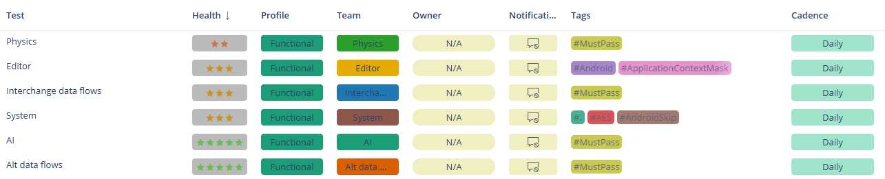

Clicking on a health badge will open the details health view for the
corresponding test.  One can modify information about the test like
intent, owner, customers, team, harness, profile, etc.  A flag for
Audit can be enabled, and notes can be attached.  A notification can
be setup to send a message to the owner and customers when the test
health degrade.

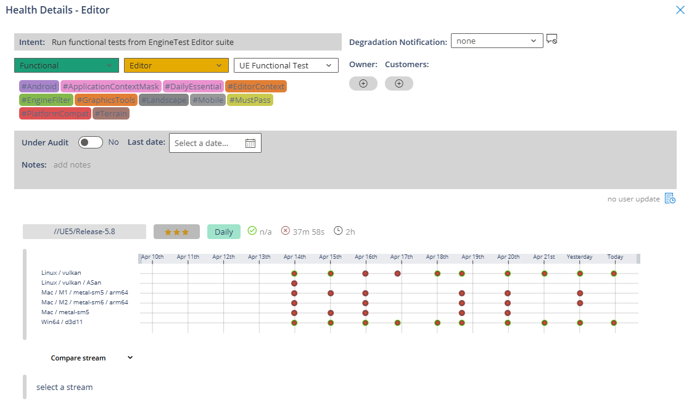
